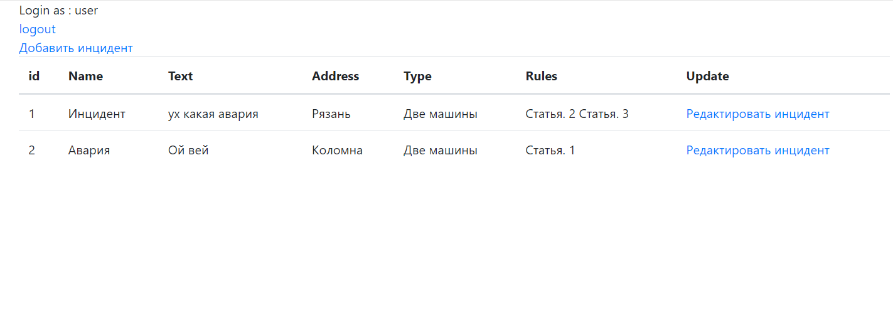
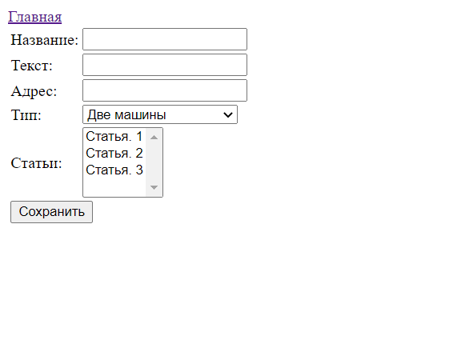
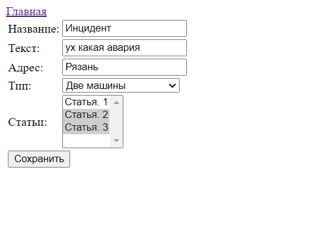
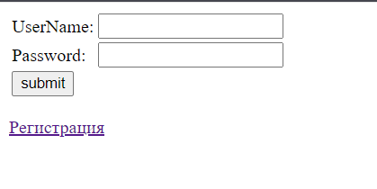

### О проекте

Реализация платформы регистрации инцидентов, с аутентификацией

### Технологии:

- Spring (MVC, ORM, Data, Security)
- JSP
- JSTL
- JDBC
- Hibernate
- PostgreSQL
- Maven
- Tomcat

### Сборка приложения
- Для сборки приложения на вашем компьютере должны быть установлены:
    - JDK 14+
    - Maven
    - PostgreSQL
    - Tomcat
- Скачайте проект к себе на компьютер с помощью команды `git clone https://github.com/iudini/job4j_forum`
- В PostgreSQL создайте базу с именем "auto_crash"
- Укажите настройки для подключения к БД в файле `src/main/resources/application.properties`
- Выполните команду `mvn install`
- Для запуска приложения скопируйте файл `target/job4j_car_accident-1.0-SNAPSHOT.war` в папку `webapp` вашего Tomcat и переименуйте его в `accident.war`
- После запуска сервера, приложение будет доступно по адресу http://localhost:8080/accident

### Главная страница

### Страница добавления нового инцидента

### Страница редактирования инцидента

### Страница авторизации

